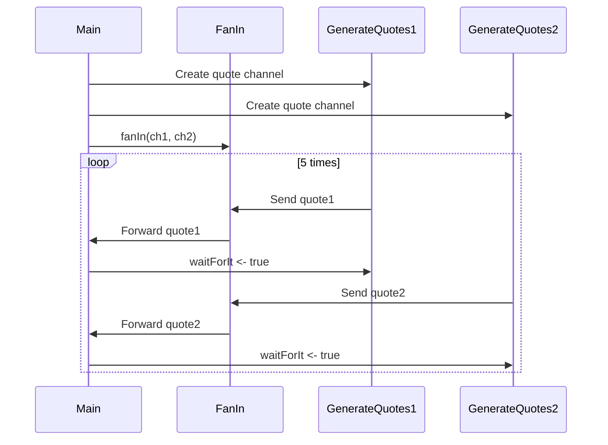

```mermaid
sequenceDiagram
    participant M as Main
    participant FI as FanIn
    participant GQ1 as GenerateQuotes1
    participant GQ2 as GenerateQuotes2

    M->>GQ1: Create quote channel
    M->>GQ2: Create quote channel
    M->>FI: fanIn(ch1, ch2)
    
    loop 5 times
        GQ1->>FI: Send quote1
        FI->>M: Forward quote1
        M->>GQ1: waitForIt <- true

        GQ2->>FI: Send quote2  
        FI->>M: Forward quote2
        M->>GQ2: waitForIt <- true
    end
```