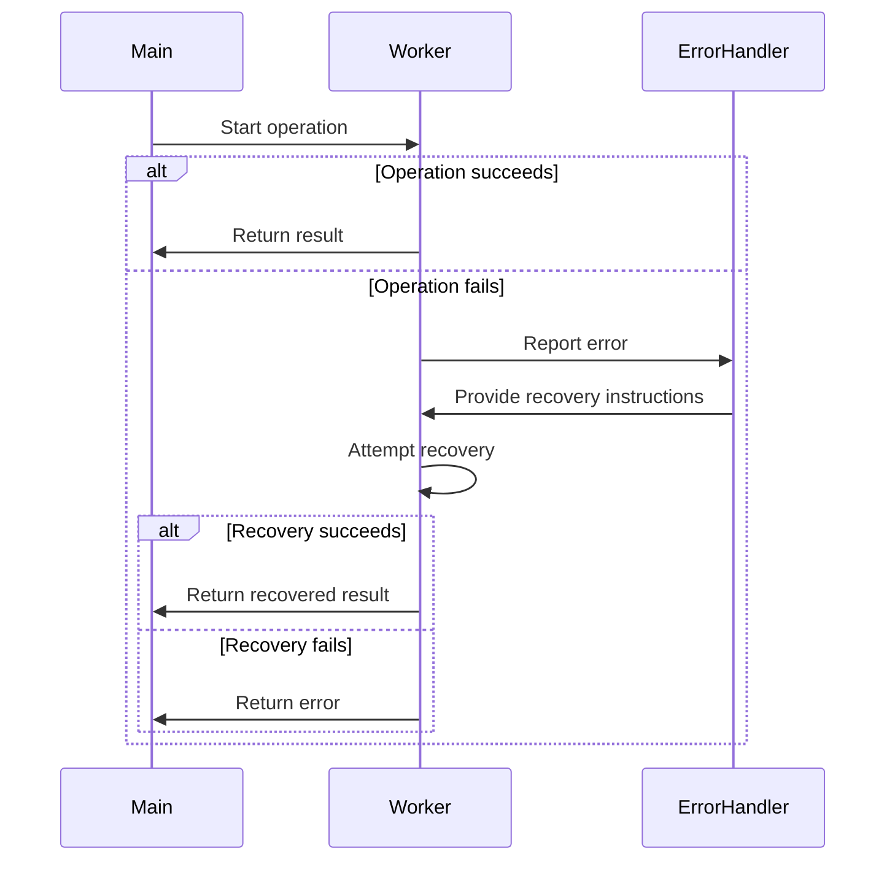

```mermaid
sequenceDiagram
    participant Main
    participant Worker
    participant ErrorHandler

    Main->>Worker: Start operation
    alt Operation succeeds
        Worker->>Main: Return result
    else Operation fails
        Worker->>ErrorHandler: Report error
        ErrorHandler->>Worker: Provide recovery instructions
        Worker->>Worker: Attempt recovery
        alt Recovery succeeds
            Worker->>Main: Return recovered result
        else Recovery fails
            Worker->>Main: Return error
        end
    end
```