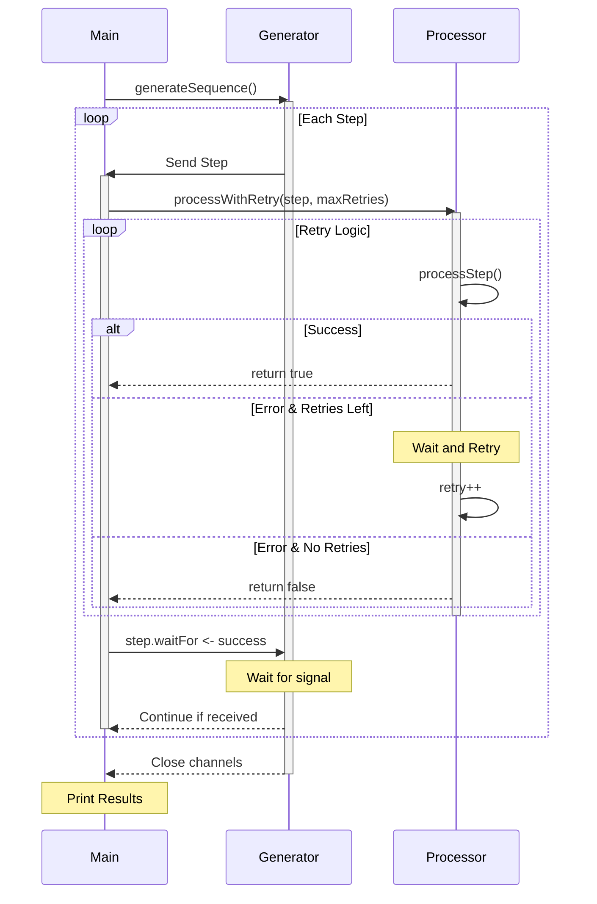

Core :
- 順序性: 步驟必須按順序執行
- 可控制: 每個步驟都可以被控制和確認
- 可恢復: 錯誤發生時可以從斷點恢復
- 一致性: 確保數據和狀態的一致性

Use Case :
- 需要嚴格順序控制的流程
- 長時間運行的任務
- 需要支援斷點續做的操作
- 對數據一致性要求高的場景

```mermaid
sequenceDiagram
    participant M as Main
    participant G as Generator
    participant P as Processor
    
    M->>G: generateSequence()
    activate G
    
    loop Each Step
        G->>M: Send Step
        activate M
        
        M->>P: processWithRetry(step, maxRetries)
        activate P
        
        loop Retry Logic
            P->>P: processStep()
            alt Success
                P-->>M: return true
            else Error & Retries Left
                Note over P: Wait and Retry
                P->>P: retry++
            else Error & No Retries
                P-->>M: return false
            end
        end
        deactivate P
        
        M->>G: step.waitFor <- success
        Note over G: Wait for signal
        G-->>M: Continue if received
        deactivate M
    end
    
    G-->>M: Close channels
    deactivate G
    
    Note over M: Print Results
```