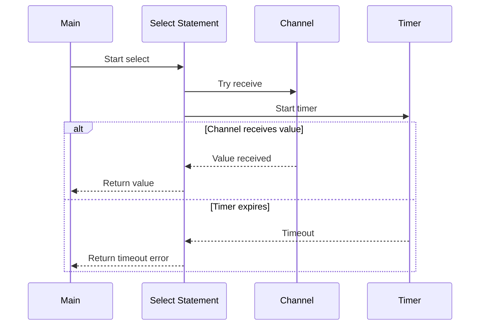

```mermaid
sequenceDiagram
    participant M as Main
    participant S as Select Statement
    participant C as Channel
    participant T as Timer

    M->>S: Start select
    S->>C: Try receive
    S->>T: Start timer
    alt Channel receives value
        C-->>S: Value received
        S-->>M: Return value
    else Timer expires
        T-->>S: Timeout
        S-->>M: Return timeout error
    end
```