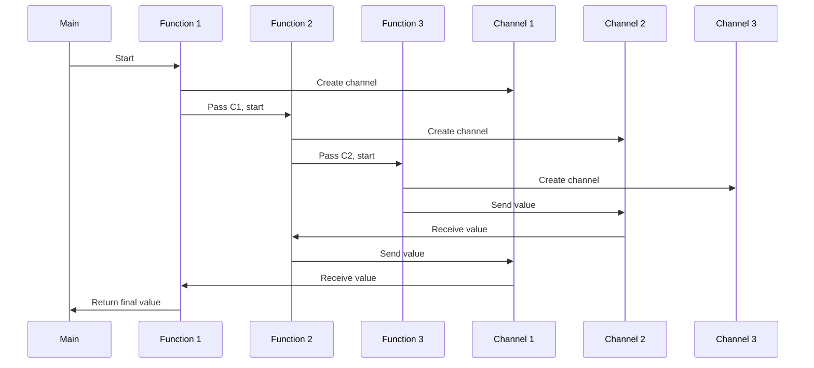

```mermaid
sequenceDiagram
    participant Main
    participant F1 as Function 1
    participant F2 as Function 2
    participant F3 as Function 3
    participant C1 as Channel 1
    participant C2 as Channel 2
    participant C3 as Channel 3

    Main->>F1: Start
    F1->>C1: Create channel
    F1->>F2: Pass C1, start
    F2->>C2: Create channel
    F2->>F3: Pass C2, start
    F3->>C3: Create channel
    F3->>C2: Send value
    C2->>F2: Receive value
    F2->>C1: Send value
    C1->>F1: Receive value
    F1->>Main: Return final value
```