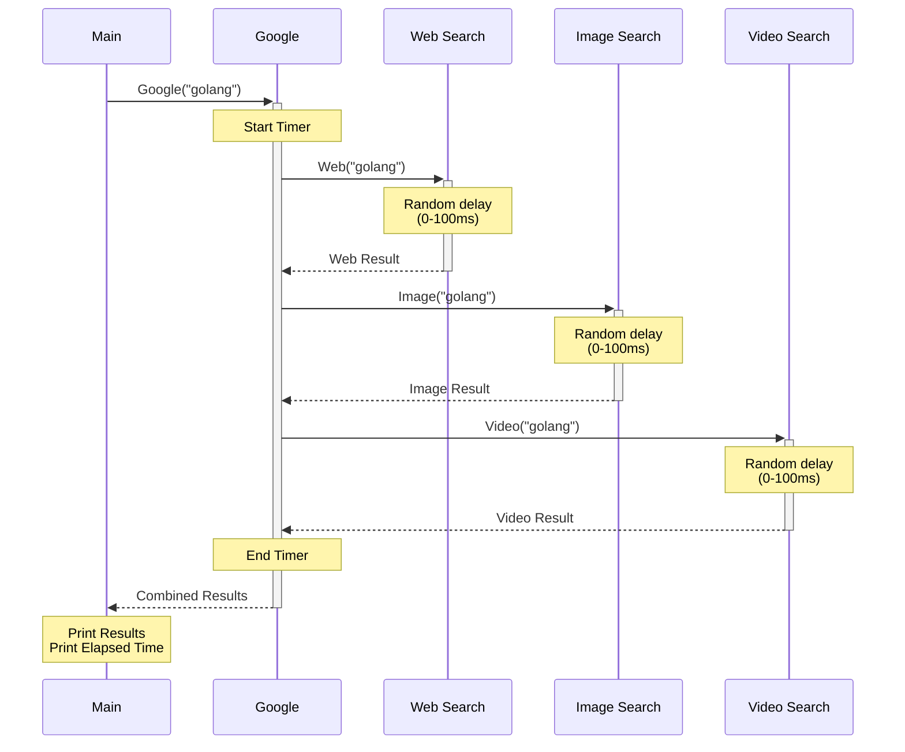

```mermaid
sequenceDiagram
    participant M as Main
    participant G as Google
    participant W as Web Search
    participant I as Image Search
    participant V as Video Search
    
    M->>+G: Google("golang")
    Note over G: Start Timer
    
    G->>+W: Web("golang")
    Note over W: Random delay<br/>(0-100ms)
    W-->>-G: Web Result
    
    G->>+I: Image("golang")
    Note over I: Random delay<br/>(0-100ms)
    I-->>-G: Image Result
    
    G->>+V: Video("golang")
    Note over V: Random delay<br/>(0-100ms)
    V-->>-G: Video Result
    
    Note over G: End Timer
    G-->>-M: Combined Results
    
    Note over M: Print Results<br/>Print Elapsed Time
```