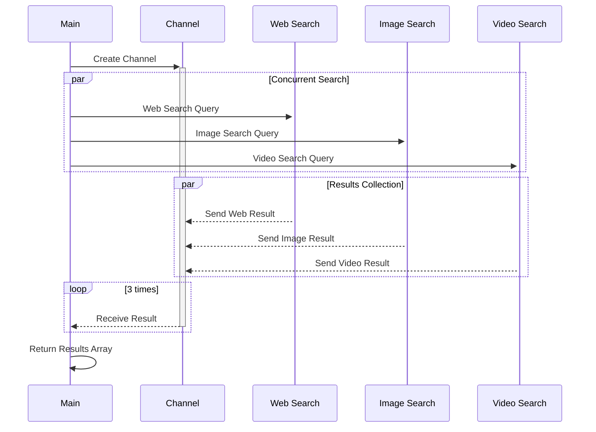

```mermaid
sequenceDiagram
    participant M as Main
    participant C as Channel
    participant W as Web Search
    participant I as Image Search
    participant V as Video Search
    
    M->>+C: Create Channel
    par Concurrent Search
        M->>+W: Web Search Query
        M->>+I: Image Search Query
        M->>+V: Video Search Query
    end
    
    par Results Collection
        W-->>C: Send Web Result
        I-->>C: Send Image Result
        V-->>C: Send Video Result
    end
    
    loop 3 times
        C-->>-M: Receive Result
    end
    
    M->>M: Return Results Array
```