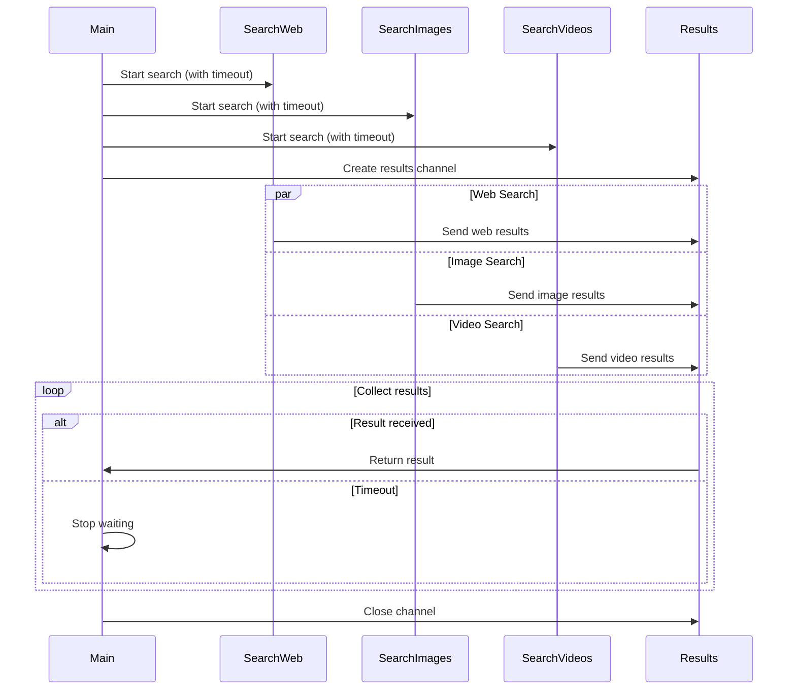

```mermaid
sequenceDiagram
    participant Main
    participant SearchWeb
    participant SearchImages
    participant SearchVideos
    participant Results

    Main->>SearchWeb: Start search (with timeout)
    Main->>SearchImages: Start search (with timeout)
    Main->>SearchVideos: Start search (with timeout)
    Main->>Results: Create results channel
    par Web Search
        SearchWeb->>Results: Send web results
    and Image Search
        SearchImages->>Results: Send image results
    and Video Search
        SearchVideos->>Results: Send video results
    end
    loop Collect results
        alt Result received
            Results->>Main: Return result
        else Timeout
            Main->>Main: Stop waiting
        end
    end
    Main->>Results: Close channel
```