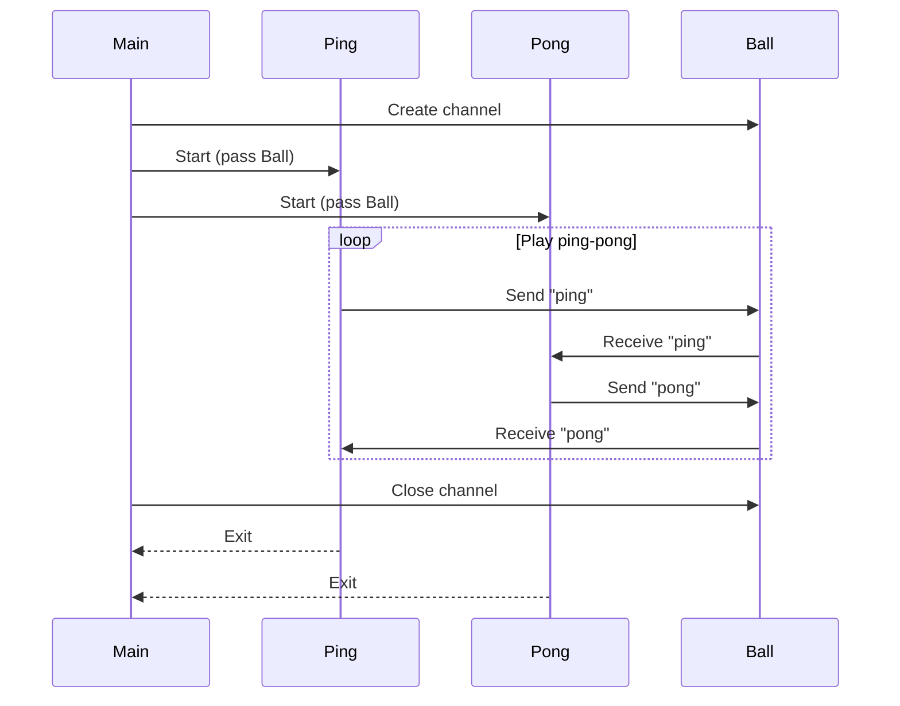

```mermaid
sequenceDiagram
    participant Main
    participant Ping
    participant Pong
    participant Ball

    Main->>Ball: Create channel
    Main->>Ping: Start (pass Ball)
    Main->>Pong: Start (pass Ball)
    loop Play ping-pong
        Ping->>Ball: Send "ping"
        Ball->>Pong: Receive "ping"
        Pong->>Ball: Send "pong"
        Ball->>Ping: Receive "pong"
    end
    Main->>Ball: Close channel
    Ping-->>Main: Exit
    Pong-->>Main: Exit
```