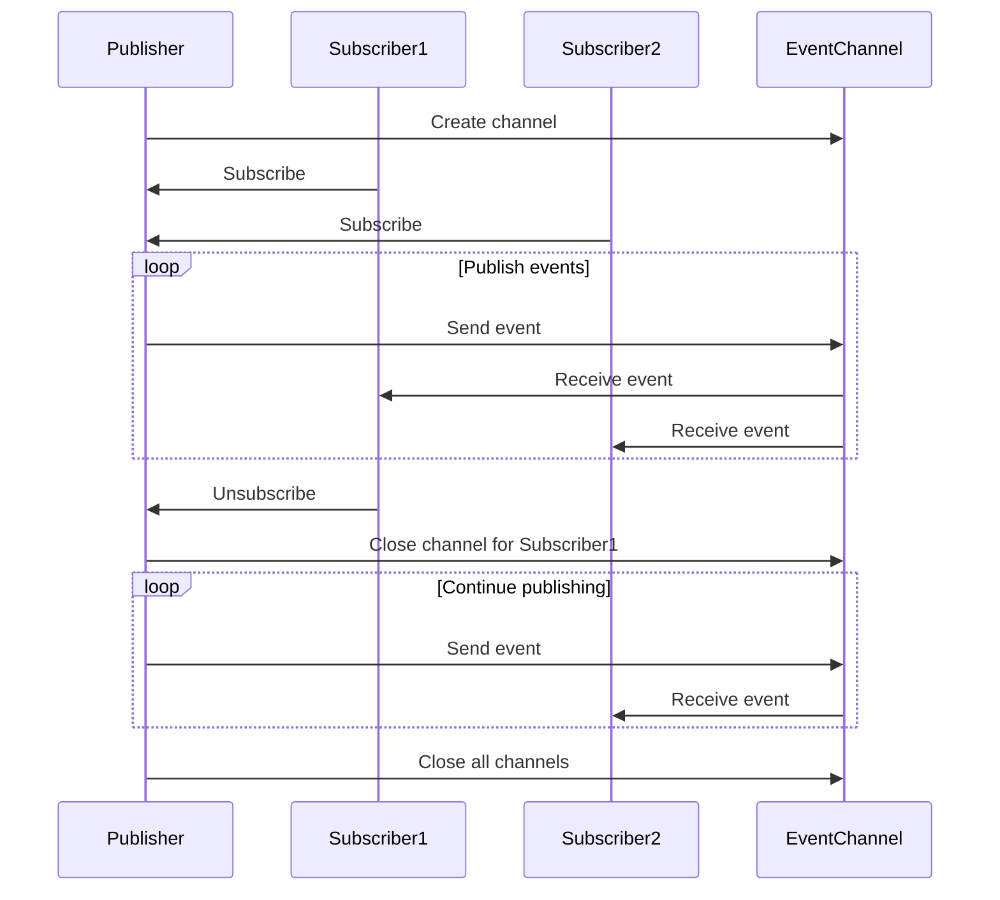

```mermaid
sequenceDiagram
    participant Publisher
    participant Subscriber1
    participant Subscriber2
    participant EventChannel

    Publisher->>EventChannel: Create channel
    Subscriber1->>Publisher: Subscribe
    Subscriber2->>Publisher: Subscribe
    loop Publish events
        Publisher->>EventChannel: Send event
        EventChannel->>Subscriber1: Receive event
        EventChannel->>Subscriber2: Receive event
    end
    Subscriber1->>Publisher: Unsubscribe
    Publisher->>EventChannel: Close channel for Subscriber1
    loop Continue publishing
        Publisher->>EventChannel: Send event
        EventChannel->>Subscriber2: Receive event
    end
    Publisher->>EventChannel: Close all channels
```