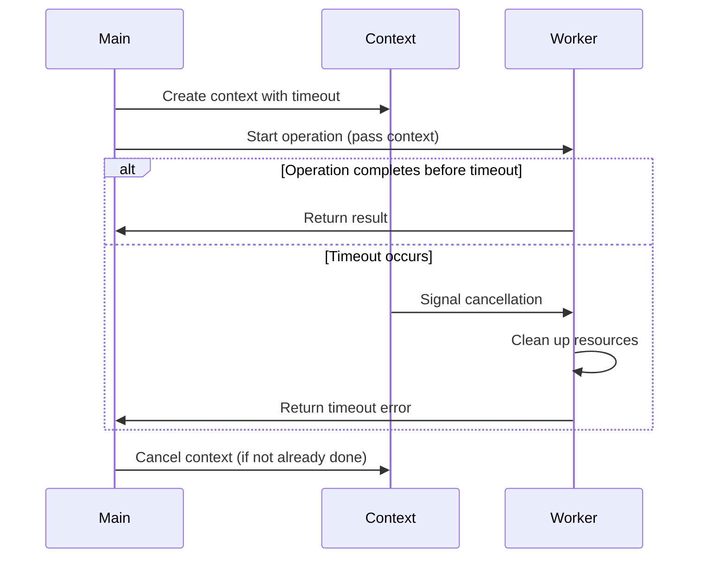

```mermaid
sequenceDiagram
    participant Main
    participant Context
    participant Worker

    Main->>Context: Create context with timeout
    Main->>Worker: Start operation (pass context)
    alt Operation completes before timeout
        Worker->>Main: Return result
    else Timeout occurs
        Context->>Worker: Signal cancellation
        Worker->>Worker: Clean up resources
        Worker->>Main: Return timeout error
    end
    Main->>Context: Cancel context (if not already done)
```