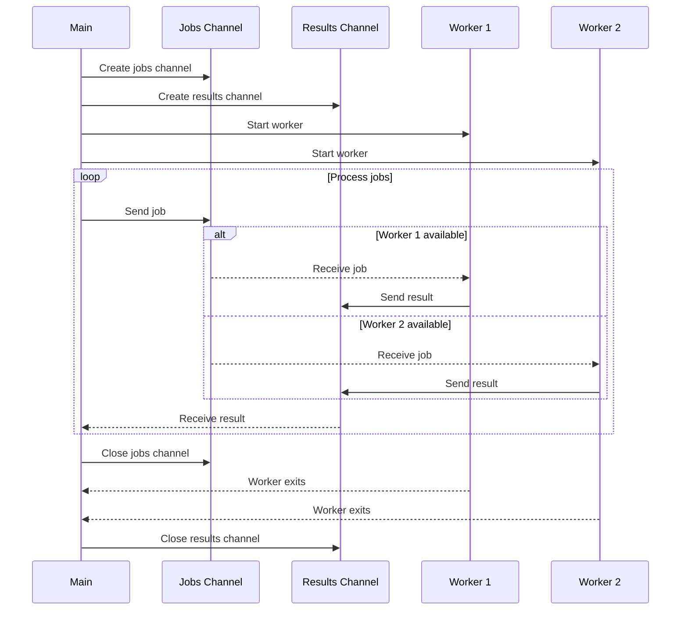

```mermaid
sequenceDiagram
    participant M as Main
    participant J as Jobs Channel
    participant R as Results Channel
    participant W1 as Worker 1
    participant W2 as Worker 2

    M->>J: Create jobs channel
    M->>R: Create results channel
    M->>W1: Start worker
    M->>W2: Start worker
    loop Process jobs
        M->>J: Send job
        alt Worker 1 available
            J-->>W1: Receive job
            W1->>R: Send result
        else Worker 2 available
            J-->>W2: Receive job
            W2->>R: Send result
        end
        R-->>M: Receive result
    end
    M->>J: Close jobs channel
    W1-->>M: Worker exits
    W2-->>M: Worker exits
    M->>R: Close results channel
```