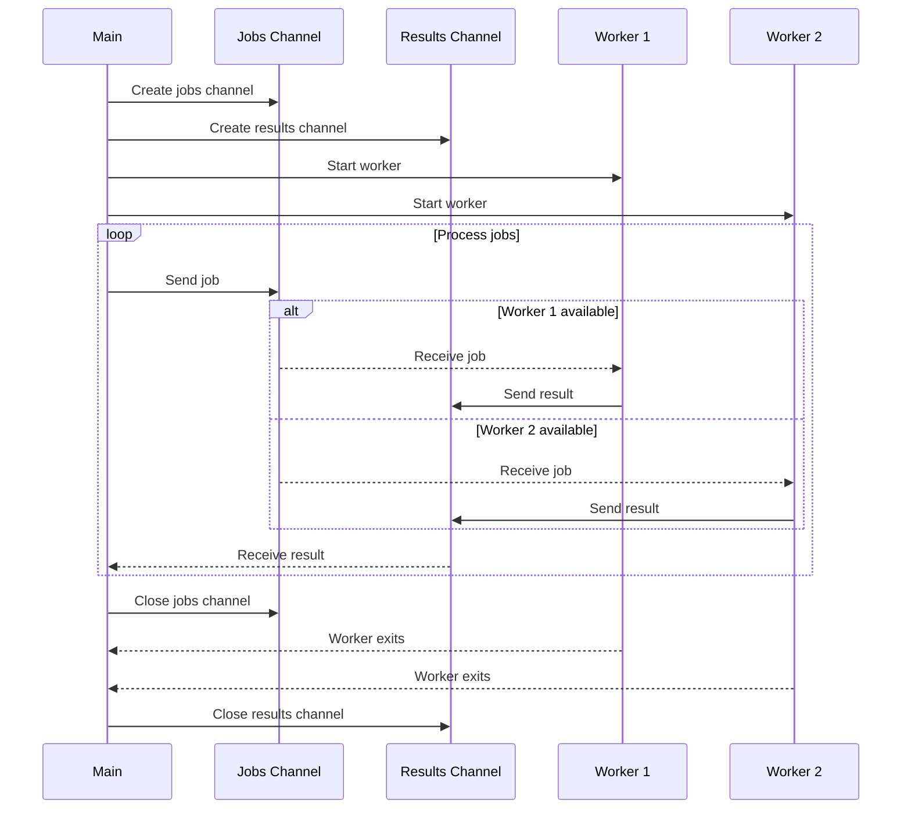
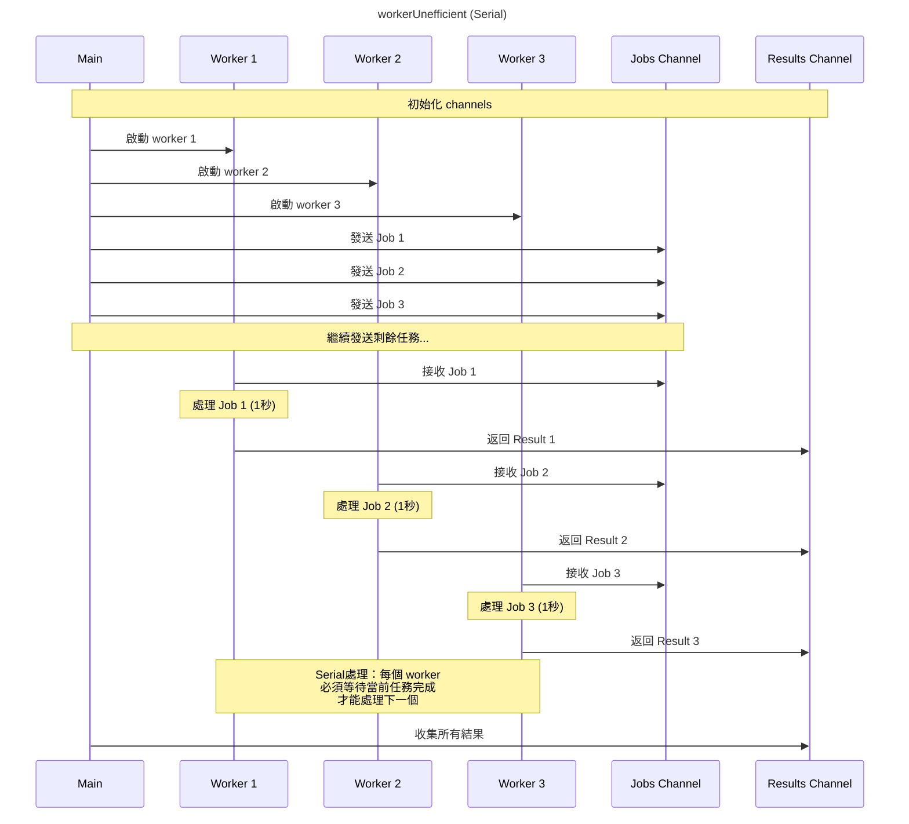
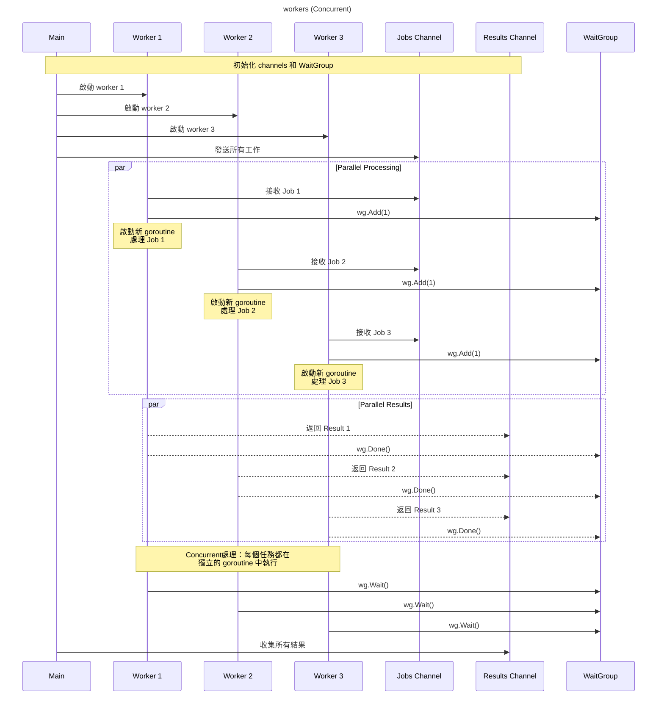
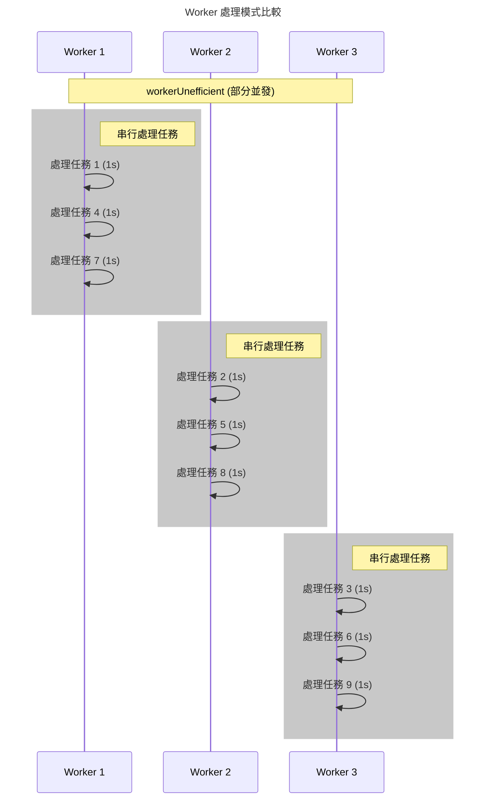
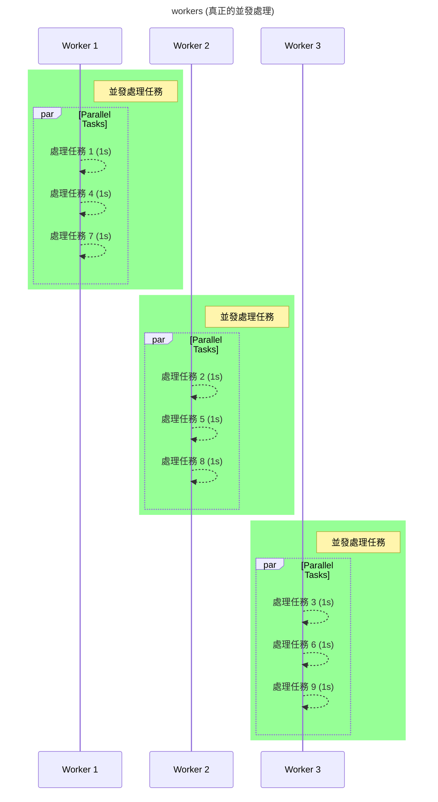

```mermaid
sequenceDiagram
    participant M as Main
    participant J as Jobs Channel
    participant R as Results Channel
    participant W1 as Worker 1
    participant W2 as Worker 2

    M->>J: Create jobs channel
    M->>R: Create results channel
    M->>W1: Start worker
    M->>W2: Start worker
    loop Process jobs
        M->>J: Send job
        alt Worker 1 available
            J-->>W1: Receive job
            W1->>R: Send result
        else Worker 2 available
            J-->>W2: Receive job
            W2->>R: Send result
        end
        R-->>M: Receive result
    end
    M->>J: Close jobs channel
    W1-->>M: Worker exits
    W2-->>M: Worker exits
    M->>R: Close results channel
```

## Compared

```mermaid
sequenceDiagram
    title workerUnefficient (Serial)
    participant M as Main
    participant W1 as Worker 1
    participant W2 as Worker 2
    participant W3 as Worker 3
    participant JC as Jobs Channel
    participant RC as Results Channel

    Note over M,RC: 初始化 channels
    
    M->>W1: 啟動 worker 1
    M->>W2: 啟動 worker 2
    M->>W3: 啟動 worker 3
    
    M->>JC: 發送 Job 1
    M->>JC: 發送 Job 2
    M->>JC: 發送 Job 3
    Note over M,JC: 繼續發送剩餘任務...
    
    W1->>JC: 接收 Job 1
    Note over W1: 處理 Job 1 (1秒)
    W1->>RC: 返回 Result 1
    
    W2->>JC: 接收 Job 2
    Note over W2: 處理 Job 2 (1秒)
    W2->>RC: 返回 Result 2
    
    W3->>JC: 接收 Job 3
    Note over W3: 處理 Job 3 (1秒)
    W3->>RC: 返回 Result 3
    
    Note over W1,W3: Serial處理：每個 worker<br/>必須等待當前任務完成<br/>才能處理下一個
    
    M->>RC: 收集所有結果
```

```mermaid
sequenceDiagram
    title workers (Concurrent)
    participant M as Main
    participant W1 as Worker 1
    participant W2 as Worker 2
    participant W3 as Worker 3
    participant JC as Jobs Channel
    participant RC as Results Channel
    participant WG as WaitGroup

    Note over M,RC: 初始化 channels 和 WaitGroup
    
    M->>W1: 啟動 worker 1
    M->>W2: 啟動 worker 2
    M->>W3: 啟動 worker 3
    
    M->>JC: 發送所有工作
    
    par Parallel Processing
        W1->>JC: 接收 Job 1
        W1->>WG: wg.Add(1)
        Note over W1: 啟動新 goroutine<br/>處理 Job 1
        
        W2->>JC: 接收 Job 2
        W2->>WG: wg.Add(1)
        Note over W2: 啟動新 goroutine<br/>處理 Job 2
        
        W3->>JC: 接收 Job 3
        W3->>WG: wg.Add(1)
        Note over W3: 啟動新 goroutine<br/>處理 Job 3
    end
    
    par Parallel Results
        W1-->>RC: 返回 Result 1
        W1-->>WG: wg.Done()
        
        W2-->>RC: 返回 Result 2
        W2-->>WG: wg.Done()
        
        W3-->>RC: 返回 Result 3
        W3-->>WG: wg.Done()
    end
    
    Note over W1,W3: Concurrent處理：每個任務都在<br/>獨立的 goroutine 中執行
    
    W1->>WG: wg.Wait()
    W2->>WG: wg.Wait()
    W3->>WG: wg.Wait()
    
    M->>RC: 收集所有結果
```

```mermaid
sequenceDiagram
    title Worker 處理模式比較
    
    participant W1 as Worker 1
    participant W2 as Worker 2
    participant W3 as Worker 3
    
    Note over W1,W3: workerUnefficient (部分並發)
    
    rect rgb(200, 200, 200)
        Note right of W1: 串行處理任務
        W1->>W1: 處理任務 1 (1s)
        W1->>W1: 處理任務 4 (1s)
        W1->>W1: 處理任務 7 (1s)
    end
    
    rect rgb(200, 200, 200)
        Note right of W2: 串行處理任務
        W2->>W2: 處理任務 2 (1s)
        W2->>W2: 處理任務 5 (1s)
        W2->>W2: 處理任務 8 (1s)
    end
    
    rect rgb(200, 200, 200)
        Note right of W3: 串行處理任務
        W3->>W3: 處理任務 3 (1s)
        W3->>W3: 處理任務 6 (1s)
        W3->>W3: 處理任務 9 (1s)
    end
```

```mermaid
sequenceDiagram
    title workers (真正的並發處理)
    
    participant W1 as Worker 1
    participant W2 as Worker 2
    participant W3 as Worker 3
    
    rect rgb(150, 255, 150)
        Note right of W1: 並發處理任務
        par Parallel Tasks
            W1-->>W1: 處理任務 1 (1s)
            W1-->>W1: 處理任務 4 (1s)
            W1-->>W1: 處理任務 7 (1s)
        end
    end
    
    rect rgb(150, 255, 150)
        Note right of W2: 並發處理任務
        par Parallel Tasks
            W2-->>W2: 處理任務 2 (1s)
            W2-->>W2: 處理任務 5 (1s)
            W2-->>W2: 處理任務 8 (1s)
        end
    end
    
    rect rgb(150, 255, 150)
        Note right of W3: 並發處理任務
        par Parallel Tasks
            W3-->>W3: 處理任務 3 (1s)
            W3-->>W3: 處理任務 6 (1s)
            W3-->>W3: 處理任務 9 (1s)
        end
    end
```