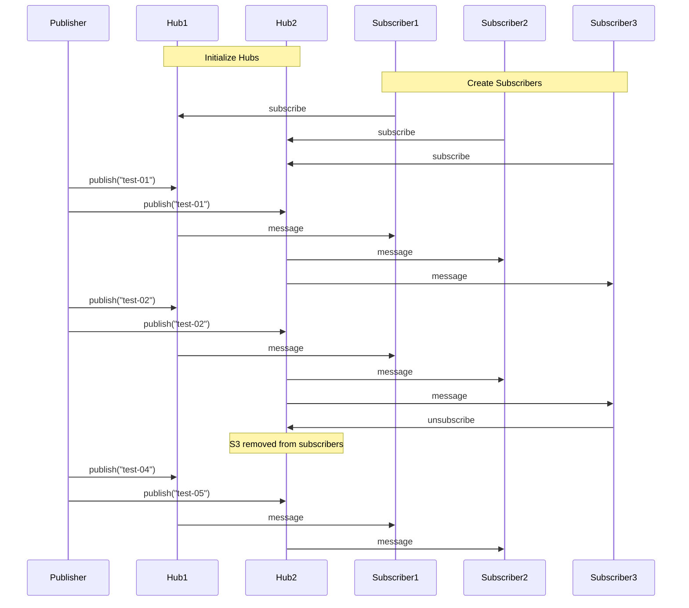

```mermaid
sequenceDiagram
    participant P as Publisher
    participant H1 as Hub1
    participant H2 as Hub2
    participant S1 as Subscriber1
    participant S2 as Subscriber2
    participant S3 as Subscriber3
    
    Note over H1,H2: Initialize Hubs
    Note over S1,S3: Create Subscribers
    
    S1->>H1: subscribe
    S2->>H2: subscribe
    S3->>H2: subscribe
    
    P->>H1: publish("test-01")
    P->>H2: publish("test-01")
    H1->>S1: message
    H2->>S2: message
    H2->>S3: message
    
    P->>H1: publish("test-02")
    P->>H2: publish("test-02")
    H1->>S1: message
    H2->>S2: message
    H2->>S3: message
    
    S3->>H2: unsubscribe
    
    Note over H2: S3 removed from subscribers
    
    P->>H1: publish("test-04")
    P->>H2: publish("test-05")
    H1->>S1: message
    H2->>S2: message
```