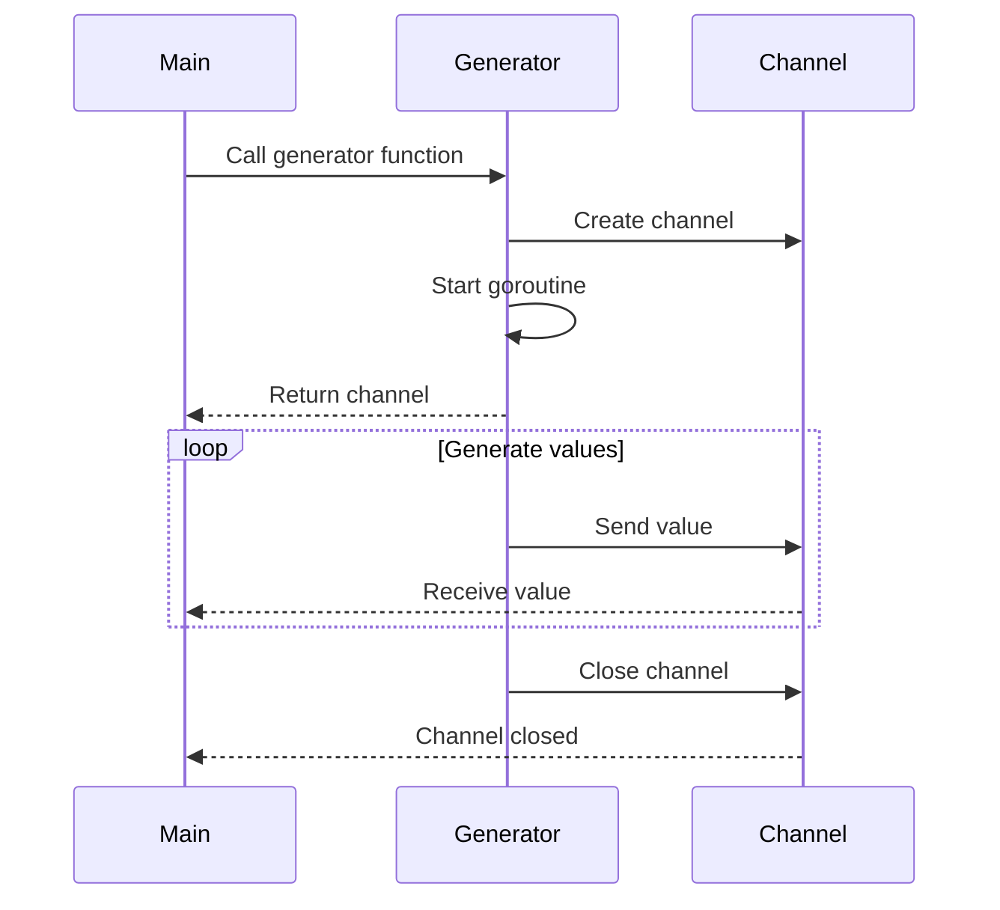

```mermaid
sequenceDiagram
    participant M as Main
    participant G as Generator
    participant C as Channel

    M->>G: Call generator function
    G->>C: Create channel
    G->>G: Start goroutine
    G-->>M: Return channel
    loop Generate values
        G->>C: Send value
        C-->>M: Receive value
    end
    G->>C: Close channel
    C-->>M: Channel closed
```