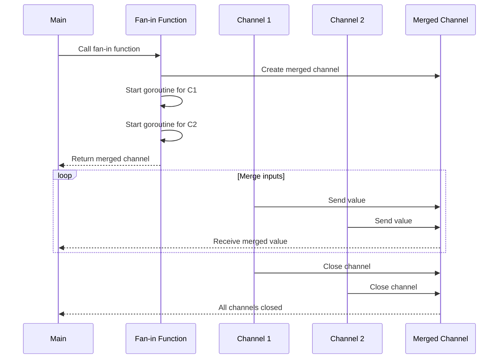

```mermaid
sequenceDiagram
    participant M as Main
    participant F as Fan-in Function
    participant C1 as Channel 1
    participant C2 as Channel 2
    participant MC as Merged Channel

    M->>F: Call fan-in function
    F->>MC: Create merged channel
    F->>F: Start goroutine for C1
    F->>F: Start goroutine for C2
    F-->>M: Return merged channel
    loop Merge inputs
        C1->>MC: Send value
        C2->>MC: Send value
        MC-->>M: Receive merged value
    end
    C1->>MC: Close channel
    C2->>MC: Close channel
    MC-->>M: All channels closed
```