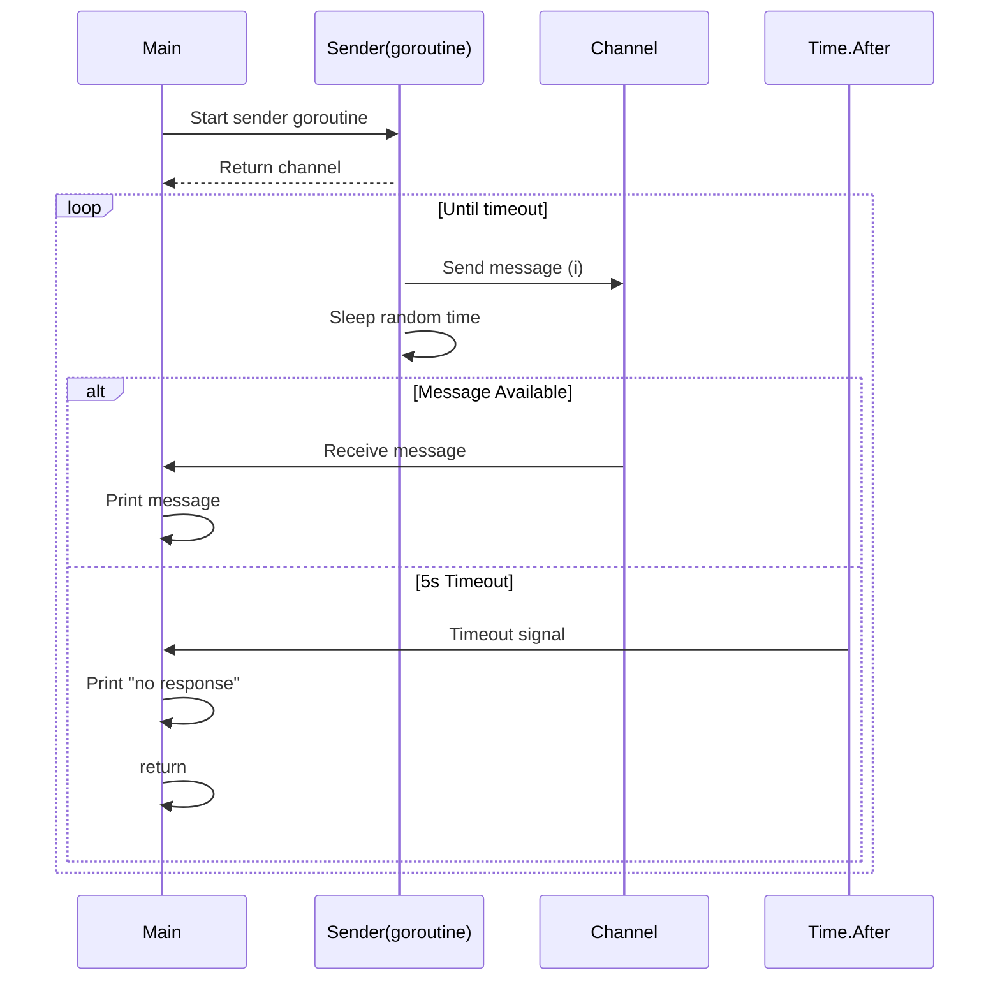

```mermaid
sequenceDiagram
    participant M as Main
    participant S as Sender(goroutine)
    participant C as Channel
    participant T as Time.After
    
    M->>S: Start sender goroutine
    activate S
    S-->>M: Return channel
    
    loop Until timeout
        S->>C: Send message (i)
        S->>S: Sleep random time
        alt Message Available
            C->>M: Receive message
            M->>M: Print message
        else 5s Timeout
            T->>M: Timeout signal
            M->>M: Print "no response"
            M->>M: return
        end
    end
```