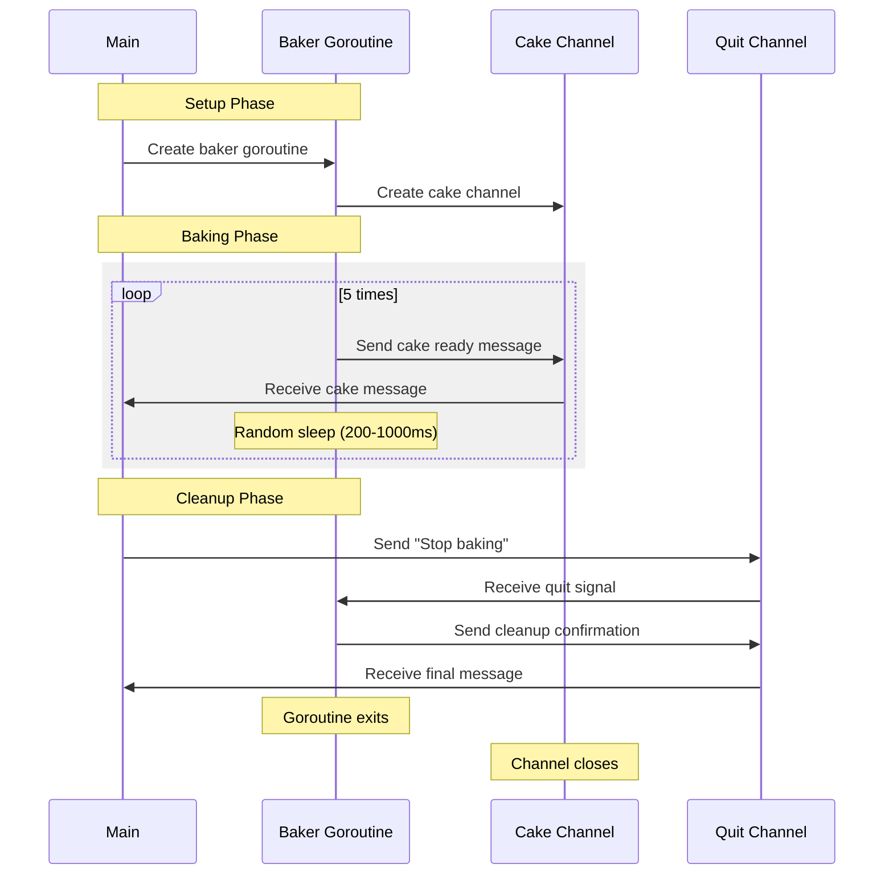

```mermaid
sequenceDiagram
    participant M as Main
    participant B as Baker Goroutine
    participant C as Cake Channel
    participant Q as Quit Channel
    
    Note over M,B: Setup Phase
    M->>B: Create baker goroutine
    B->>C: Create cake channel
    
    Note over M,B: Baking Phase
    rect rgb(240, 240, 240)
        loop 5 times
            B->>C: Send cake ready message
            C->>M: Receive cake message
            Note over B: Random sleep (200-1000ms)
        end
    end
    
    Note over M,B: Cleanup Phase
    M->>Q: Send "Stop baking"
    Q->>B: Receive quit signal
    B->>Q: Send cleanup confirmation
    Q->>M: Receive final message
    
    Note over B: Goroutine exits
    Note over C: Channel closes
```