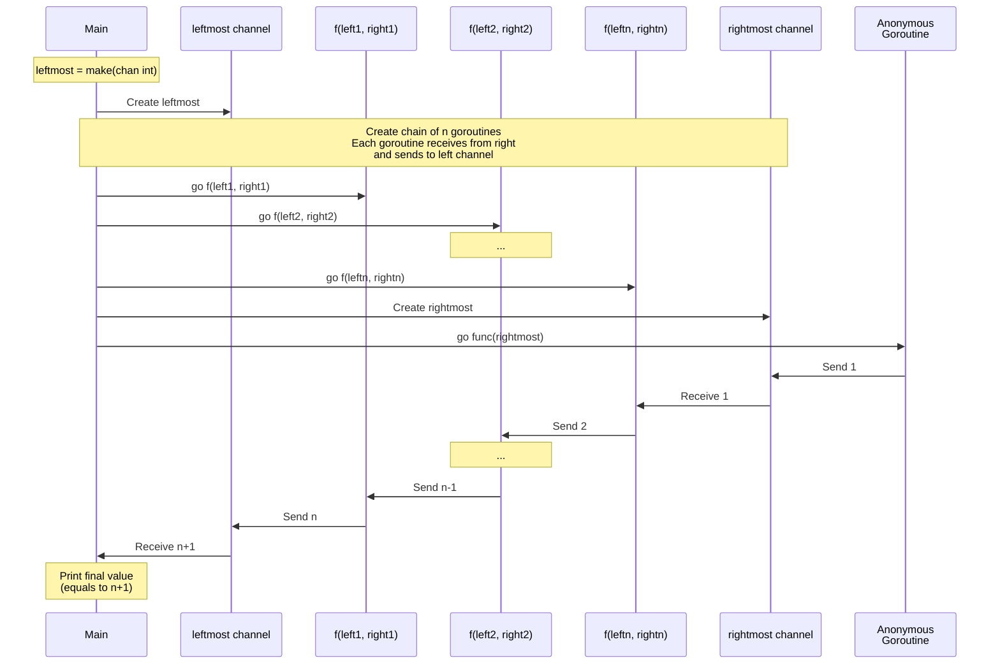

```mermaid
sequenceDiagram
    participant M as Main
    participant L as leftmost channel
    participant G1 as f(left1, right1)
    participant G2 as f(left2, right2)
    participant Gn as f(leftn, rightn)
    participant R as rightmost channel
    participant AG as Anonymous<br/>Goroutine

    Note over M: leftmost = make(chan int)
    
    M->>L: Create leftmost
    
    Note over M,R: Create chain of n goroutines<br/>Each goroutine receives from right<br/>and sends to left channel
    M->>G1: go f(left1, right1)
    M->>G2: go f(left2, right2)
    Note over G2: ...
    M->>Gn: go f(leftn, rightn)
    M->>R: Create rightmost
    
    M->>AG: go func(rightmost)
    AG->>R: Send 1
    
    R->>Gn: Receive 1
    Gn->>G2: Send 2
    Note over G2: ...
    G2->>G1: Send n-1
    G1->>L: Send n
    L->>M: Receive n+1
    
    Note over M: Print final value<br/>(equals to n+1)
```